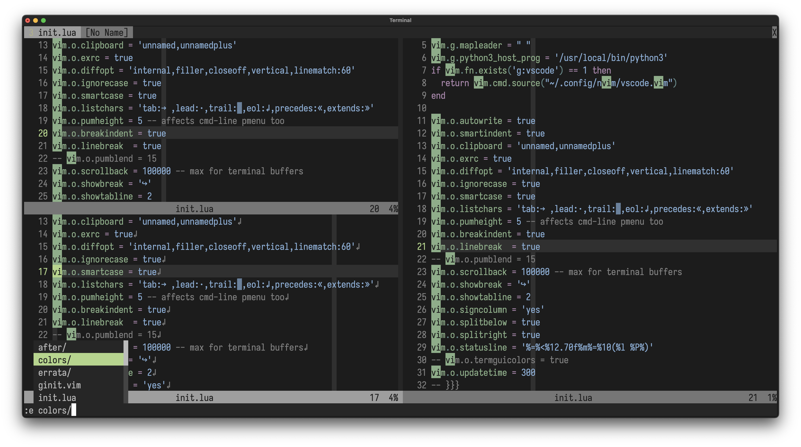
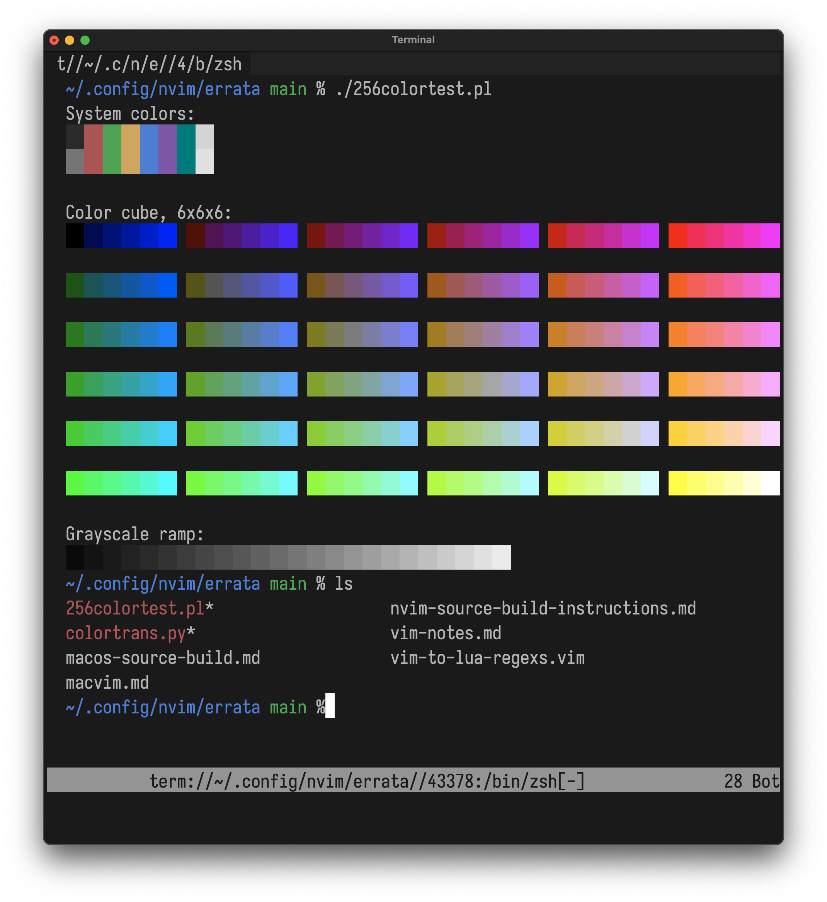
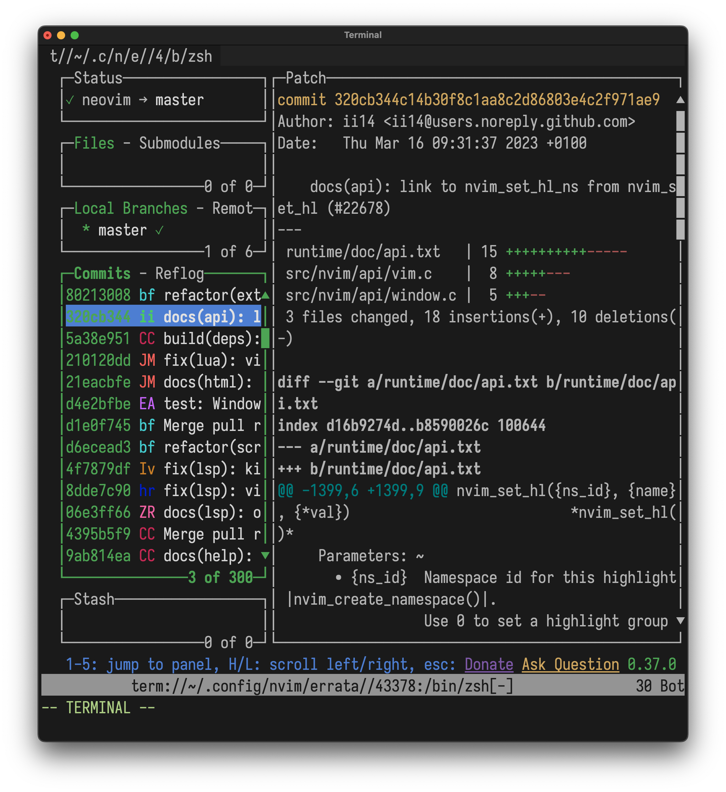
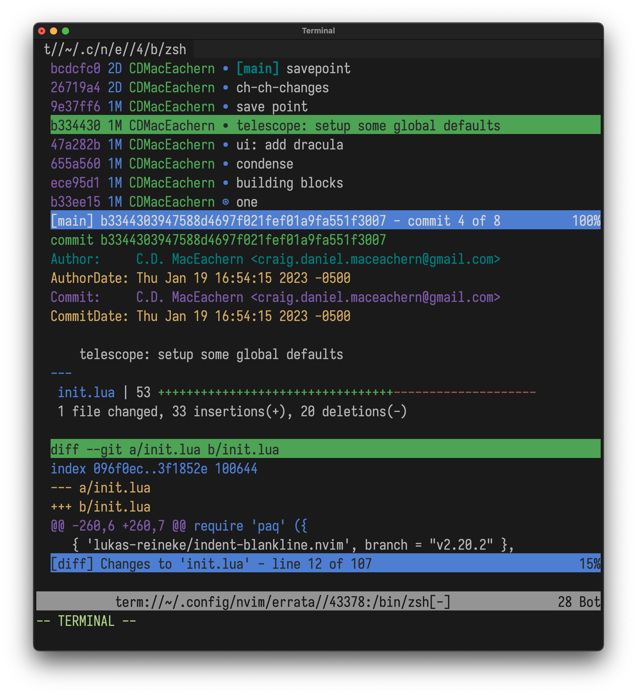

# neo

neo is a Neovim-branded colorscheme.

# Show me!

Below screens are temporary while I torture test and run through and adapt
the colorscheme tests tooling at [vim/colorschemes](https://github.com/vim/colorschemes).

## Code and configuration sample

Some random person's init.lua:

## Terminal buffer examples

Pictures of the colorscheme being used as the palette for a terminal buffer.

macOS's Terminal.app emulator palette hand-set to our palette (`termguicolors`
is off):

lazygit in a terminal buffer:

tig in a terminal buffer:

## Requirements

* any version of Neovim
* any 256-colour (8bit) capable terminal emulator, or
* any truecolour (24bit) capable terminal emulator

## Features

* colours look exactly the same with `termguicolors` option turned on or off -
no sub-par, downgraded palette in the terminal version
* covers the minimum required preferred groups, giving you just enough colour
without overdoing it
* no bold or italic fonts needed for 'complete' design
* follows best practices in design and usage learned during the recent Vim 9
colorscheme updates to ensure consistency and predicability
* follows best practices in color theory in terms of colour grouping schemes
and cohesion
* ANSI palette for `:terminal` buffers is based on the official Neovim green
(`#`) and blue (`#`) as sampled from Neovim logos kit, and translated into
closest 256 xterm-palette approximation.

## Caveats and limitations

### Colorblindness

Unfortunately, supporting the 3 types of colorblindness can't be done under
these already considerable restrictions in palette choice, while also
retaining the Neovim-branding and looking coherent to those without
colorblindness.
I'd love to be proven wrong, though!

## Design

'neo' was designed around the official Neovim green and blue, translated them
first into their closest approximate 256-colour in the [xterm-palette space](https://upload.wikimedia.org/wikipedia/commons/thumb/1/15/Xterm_256color_chart.svg/1404px-Xterm_256color_chart.svg.png).
This xterm-ified green and blue were then desaturated to be provide a mid-contrast, comforting, eye-soothing palette.

## Inspiration and thanks

* [habamax colorscheme](https://github.com/habamax/vim-habamax), which was
shipped with Vim 9.0. We landed on very similar color values and I took a lot
of comfort knowing these colors have already been out in use in the wild for a
bit now (and also for just being a great colorscheme).
* [neovim.io](https://neovim.io) for the official colour references
* [vim/colorschemes](https://github.com/vim/colorschemes), for the tooling,
wisdom, and best practices
* VS Code Dark default colorscheme for such a well-thought out and balanced
approach
* You, if you're trying it out! Help and constructive comments are welcome!
